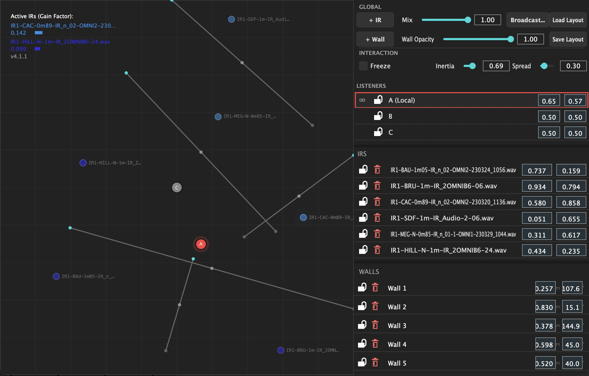
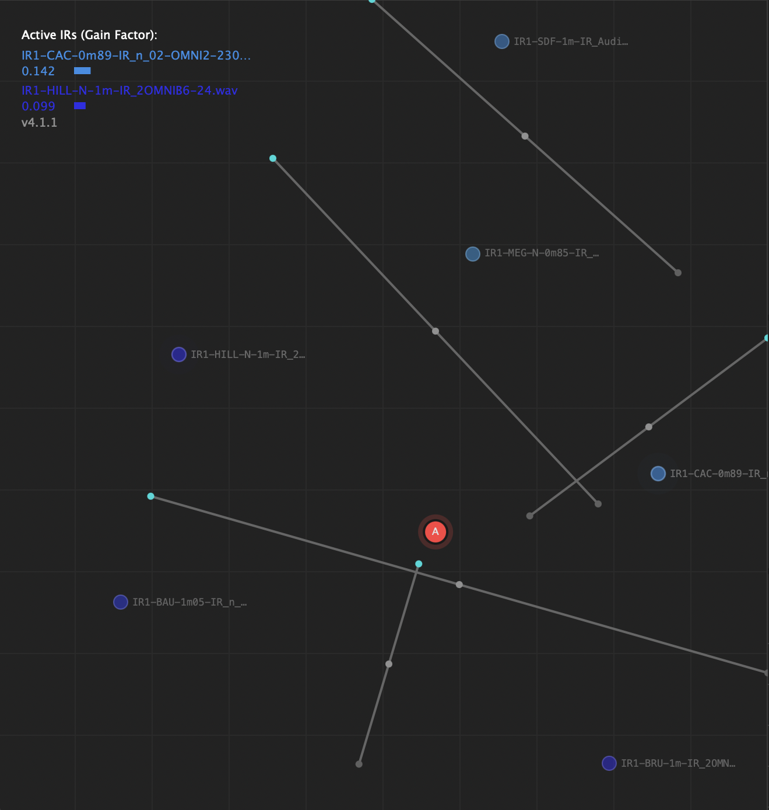
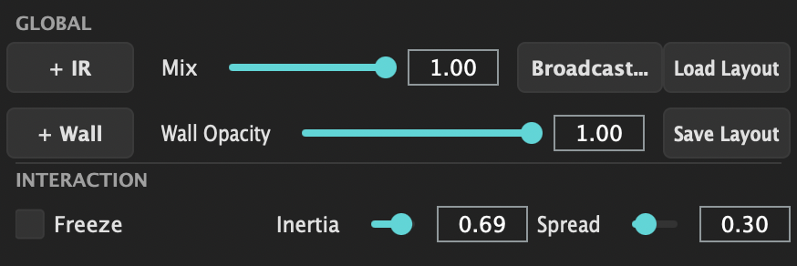
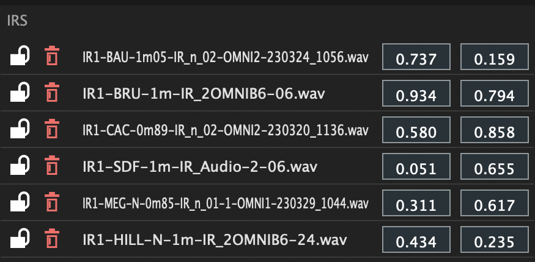

# IRIS — Spatial IR Convolution Plugin (V4)

This repository contains the IRIS spatial convolution plugin. The latest version is **IRIS4**.

This README provides a quick overview of the plugin, build instructions, and the OSC integration spec. For an in-depth explanation of the underlying physics engine, listener synchronization, and spatial algorithms, please refer to the `TECHNICAL_Description.md` document.

## Overview
IRIS is a spatial convolution plugin built with JUCE. It loads multiple impulse responses (IRs) as spatial sources within a normalized 2D room map. It computes nearest-neighbor distances and calculates dynamic Gaussian weights to render a seamlessly crossfaded mono-convolved signal mixed with the dry input. 

In V4, IRIS has been overhauled with a modern "Flat Utility" aesthetic, symmetric Listener-to-Listener spatial linking (using an edge-graph), and global physics parameters (Inertia, Freeze) smoothly synchronized across all plugin instances over OSC.

## UI Regions & Screenshots



- **Main Interface (Room Map)**: 
- **Control Panel**: 
- **Listener List**:  
- **IR List**: 
- **Wall List**:  

## Features (IRIS V4)
- **Multi-IR points**: Placed on a normalized 2D room map (0.0–1.0 coordinates).
- **Multi-Listener Network**: Connect multiple listener instances together. When linking listeners (e.g., A to B), the network computes a symmetric adjacency matrix and propagates positional movements hierarchically, keeping multiple DAWs or tracks perfectly in sync spatially.
- **Occlusion Dynamics (Walls)**: Draw physical walls on the map to accurately attenuate the acoustic contribution of specific IRs when intersected by the listener's line of sight.
- **Physics Engine**: Sliders for `Inertia` (momentum-based listener gliding) and `Freeze` (locking the engine's interpolation state).
- **Parametric Spread & Mix**: Dynamically adjust the Gaussian falloff width of the IR points and the dry/wet matrix.
- **Full OSC Synchronization**: Listeners, IR points, Walls, and global parameters (Spread, Mix, Inertia, Freeze) are seamlessly broadcast and mirrored across all instantiated instances.
- **Modern UI Redesign**: A flat, minimalist, dark-themed utility aesthetic.

## Build Requirements
- CMake >= 3.15
- A C++17 capable compiler (Apple Clang, GCC, MSVC)
- The JUCE framework will be automatically fetched by CMake during the initial configuration, so no manual installation is required.

### Quick Build
```bash
cd IRIS_VST
mkdir -p build && cd build
cmake ..
cmake --build . --target IRIS4_VST3 -j 8
```
The compiled VST3 bundle will be available at `build/IRIS4_artefacts/Release/VST3/IRIS4.vst3`. Copy it to `~/Library/Audio/Plug-Ins/VST3/`.

## OSC Integration Specs
IRIS4 uses a decentralized OSC architecture (defaults to sending/receiving on ports 9001/9002).

**Listener Management:**
- `/iris/listener/sync [uuid id, string name, float x, float y, int linked, int locked]`
- `/iris/listener/matrix [string source_id, string matrix_str]` - Broadcasts the symmetric edge graph.

**Parameter Synchronization:**
- `/iris/param/inertia [float]`
- `/iris/param/freeze [float]`
- `/iris/param/spread [float]`
- `/iris/param/mix [float]`
- `/iris/param/wallOpacity [float]`

**IR & Environment:**
- `/iris/ir/pos [string id, float x, float y]`
- `/iris/wall/pos [string id, float x1, float y1, float x2, float y2]`
