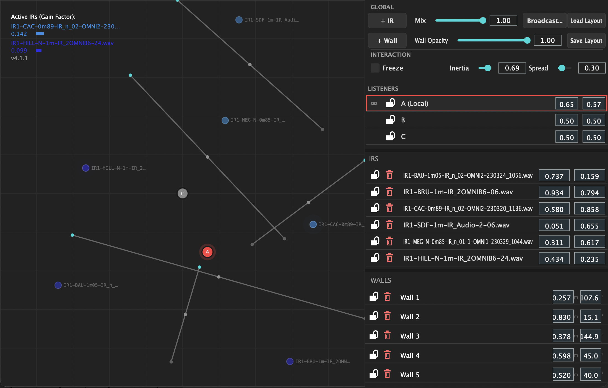
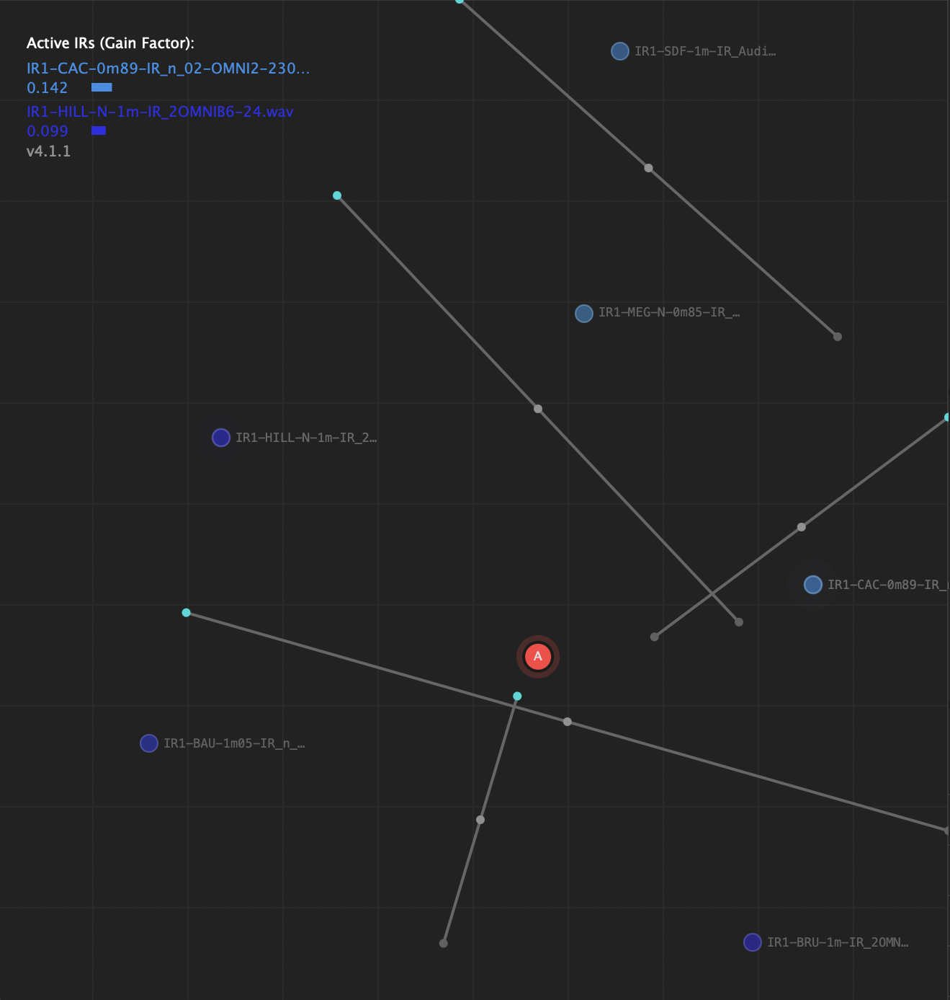
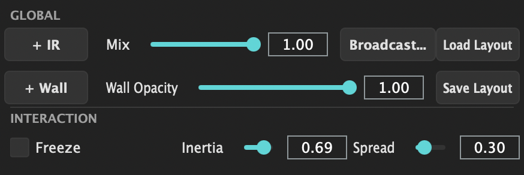
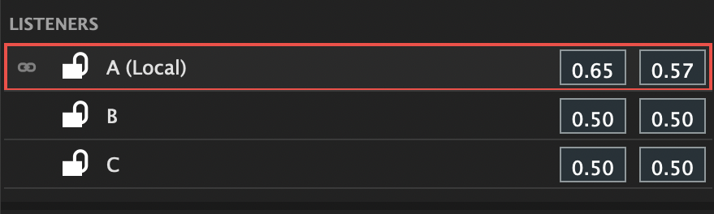
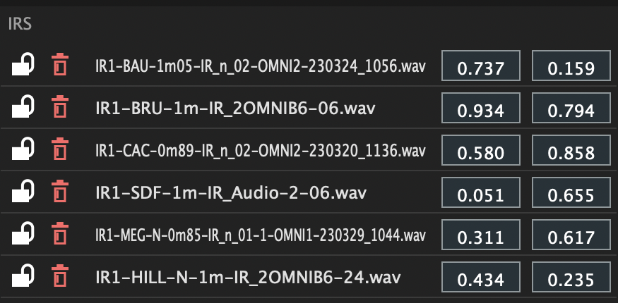
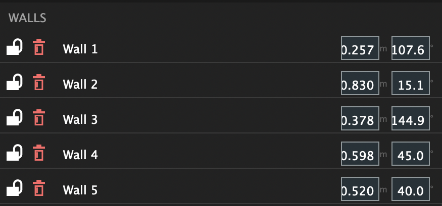

# IRIS — Spatial IR Convolution Plugin (V4)

This repository contains the IRIS spatial convolution plugin. The latest version is **IRIS4**.

This README provides a quick overview of the plugin, build instructions, and the OSC integration spec. For an in-depth explanation of the underlying physics engine, listener synchronization, and spatial algorithms, please refer to the `TECHNICAL_Description.md` document.

## Overview
IRIS is a spatial convolution plugin built with JUCE. It loads multiple impulse responses (IRs) as spatial sources within a normalized 2D room map. It computes nearest-neighbor distances and calculates dynamic Gaussian weights to render a seamlessly crossfaded mono-convolved signal mixed with the dry input. 

In V4, IRIS has been overhauled with a modern "Flat Utility" aesthetic, symmetric Listener-to-Listener spatial linking (using an edge-graph), and global physics parameters (Inertia, Freeze) smoothly synchronized across all plugin instances over OSC.

## UI Regions & Screenshots



- **Main Interface (Room Map)**: 
- **Control Panel**: 
- **Listener List**:  
- **IR List**: 
- **Wall List**:  

## Features (IRIS V4)
- **Multi-IR points**: Placed on a normalized 2D room map (0.0–1.0 coordinates).
- **Multi-Listener Network**: Connect multiple listener instances together. When linking listeners (e.g., A to B), the network computes a symmetric adjacency matrix and propagates positional movements to every linked listener. All IRIS instances inside one DAW stay in sync directly; see *OSC* below for what crosses process boundaries.
- **Occlusion Dynamics (Walls)**: Draw walls on the map to attenuate the contribution of IRs behind them (line of sight from the listener). Each wall has an `attenuation` (0 = blocks fully, 1 = transparent; set in layout JSON, default 0.05) scaled by the global *Wall Opacity*. Walls that meet at a corner seal it.
- **Physics Engine**: Sliders for `Inertia` (momentum-based listener gliding) and `Freeze` (locking the engine's interpolation state).
- **Parametric Spread & Mix**: Dynamically adjust the Gaussian falloff width of the IR points and the dry/wet matrix.
- **Output Gain**: -60 dB to +12 dB, default 0 dB. With *Normalize* on, every IR is scaled to unity energy, so the wet signal plays at roughly the level of the dry signal whatever the IR length. Sessions saved with IRIS ≤ 4.3 get +30 dB added to their saved Output Gain on load (the old normalisation was ~30 dB hotter).
- **Interpolation**: The nearest IRs are blended with equal-power gains, and *Mix* alone sets the wet/dry balance (moving away from the IRs no longer turns the reverb into dry signal).
- **Automatable Listener**: The listener's X and Y coordinates are exposed as plugin parameters for DAW envelopes and automation.
- **Convolution engine**: Zero-latency, non-uniform partitioned convolution (4096-sample head). Active IRs are convolved in parallel on realtime worker threads that join the host's audio workgroup. IR changes crossfade instead of cutting.
- **Instance Synchronization**: Listeners, IR points, walls and global parameters (Spread, Mix, Inertia, Freeze, Wall Opacity, Normalize, Align) are mirrored across all IRIS instances in the same DAW, and sent as OSC to port 9002 for external tools.
- **Granular OSC Broadcasting**: Per-parameter checkboxes to control exactly which parameters (e.g. Inertia vs Mix) are sent over the network.
- **Modern UI Redesign**: A flat, minimalist, dark-themed utility aesthetic.

## Demo Layout

To quickly test the plugin's spatialization and multi-node functionality, a pre-configured JSON layout and a set of sample impulse responses are included in the `demo/` folder of this repository.

**How to load the demo:**
1. Open the **IRIS4** plugin in your DAW or plugin host.
2. Click the **"Import JSON"** (📁) button in the upper menu bar (next to the global parameters).
3. Navigate to the `IRIS/demo/` folder and select the `demo_layout.json` file.
4. The plugin will automatically populate the Room Map with the 4 sample IRs. Relative `path` entries are resolved next to the JSON file; absolute paths are used as-is.

## Build Requirements
- CMake >= 3.15
- A C++17 capable compiler (Apple Clang, GCC, MSVC)
- **JUCE is fetched automatically** by CMake during the initial configuration (via `FetchContent`), so no manual installation is required.

### Build Instructions

```bash
cd IRIS_VST
mkdir -p build && cd build
cmake ..
cmake --build . --config Release -j 8
```

The compiled bundles are at `IRIS4_artefacts/Release/VST3/IRIS4.vst3` and `IRIS4_artefacts/Release/AU/IRIS4.component`. Copy them to `~/Library/Audio/Plug-Ins/VST3/` and `~/Library/Audio/Plug-Ins/Components/`, then validate the AU with `auval -v aufx Irs4 IRIS`.

On macOS the build produces a Universal binary (Apple Silicon + Intel) targeting macOS 11.0 and later by default (the oldest version the current Xcode C++ library supports; it covers every Intel Mac that runs macOS 11–26). Check with:

```bash
lipo -info IRIS4_artefacts/VST3/IRIS4.vst3/Contents/MacOS/IRIS4          # expect: x86_64 arm64
vtool -show-build IRIS4_artefacts/VST3/IRIS4.vst3/Contents/MacOS/IRIS4   # expect: minos 11.0
```

If you reuse an old `build/` folder created before this change, delete it first so CMake picks up the new settings.

Alternatively, use the included convenience script which builds, installs, and cleans up automatically:

```bash
cd IRIS_VST
chmod +x compile.sh
./compile.sh
```

## OSC Integration Specs
IRIS4 **receives** OSC on UDP port 9001 (all network interfaces) and **sends** to `127.0.0.1:9002`.

- Instances inside one DAW process share state directly, without the network.
- Only one process on a machine can own port 9001. If a second DAW runs IRIS, its instances still work but do not receive OSC; the editor shows an orange "port 9001" notice.
- IRIS does not relay 9002 back to 9001, so two DAW processes do not sync with each other on their own. An external tool (Max, Pure Data, a script) can listen on 9002 and forward to another machine's 9001.
- All incoming values are validated: non-finite numbers, wrong types and malformed ids are ignored, and at most 64 remote listeners are tracked.

**Received on 9001:**
- `/iris/listener/sync [string uuid, string name, float x, float y, int linked, int locked]` — creates or moves a listener (x, y in 0..1). A locked local listener is not moved.
- `/iris/listener/matrix [string source_uuid, string edges]` — edges as `uuidA:uuidB,uuidC:uuidD`.
- `/iris/listener/remove [string uuid]`
- `/iris/param/{mix|spread|inertia|freeze|wallOpacity|normalize|align} [float]` — applied only by instances that have that parameter ticked in the Broadcast menu.
- `/iris/ir/pos [string uuid, float x, float y]`, `/iris/ir/name [string uuid, string name]`
- `/iris/wall/pos [string uuid, float x1, float y1, float x2, float y2]`

**Sent to 9002** (same formats): the messages above, plus `/iris/ir/add [uuid, name, path]`, `/iris/ir/remove [uuid]`, `/iris/wall/add [uuid, x1, y1, x2, y2]`, `/iris/wall/remove [uuid]`, and `/iris/weights [string name, float weight, ...]` with the current interpolation weights.

## Testing OSC

A Python test script is included. It moves listener `A`'s position around a circle and changes Spread (you need the listener's UUID; copy it from the `/iris/listener/sync` messages IRIS sends to port 9002, e.g. with `--listen`):

```bash
pip install python-osc
python IRIS_VST/test_osc.py
```
